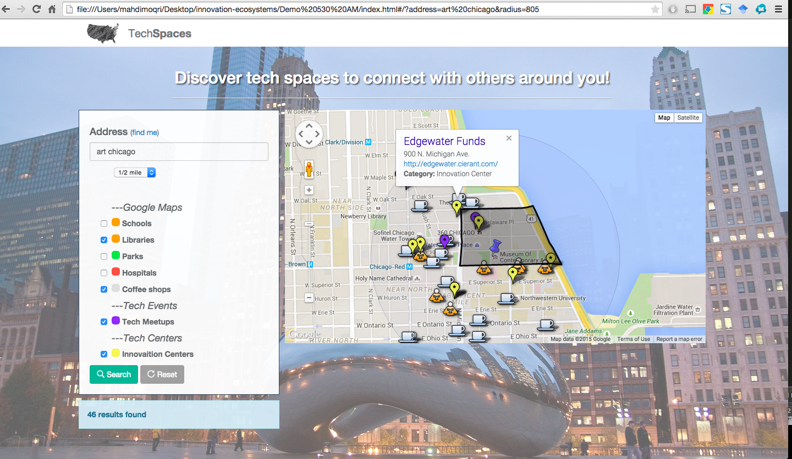

# innovation-ecosystems
Understanding city innovation hotspots using the Census CitySDK

### Using Census Data and the City SDK to inform Space Selection

In order to increase diversity in the technology sector, organizers may wish to plan events in neighborhoods that are currently underrepresented, have high populations of young people, or are built of many individuals who have completed high school/recieved their GEDs.  

*Note: City SDK aliases used when available

####Youth Impact
Youth Count is the total count of teenagers between the ages of 10 and 17
Youth Count:  (B01001_005E + B01001_006E + B01001_029E + B01001_030E)

Youth Impact is the percentage of people between the ages of 10 and 17
Youth Impact:  (B01001_005E + B01001_006E + B01001_029E + B01001_030E)/population
              (males 10-14 + males 15-17 + females 10-14 + females 15-17)/population

####Career Changer Impact

Calculation: (education_high_school + education_ged)/population

####Poverty Impact
Calculation:  poverty/education
